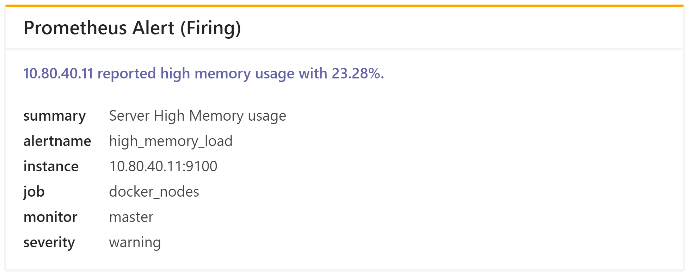

[](https://circleci.com/gh/bzon/prometheus-msteams)
[](https://codecov.io/gh/bzon/prometheus-msteams)

# Overview

A lightweight Go Web Server that accepts POST alert message from Prometheus Alertmanager and sends it to Microsoft Teams Channels using an incoming webhook url.



## Configuration File

It is recommended to use a config file to make the webserver expose multiple request uri that can cater multiple Teams channel webhooks.

```yaml
# /tmp/config.yml
connectors:
- high_priority_channel: "https://outlook.office.com/webhook/xxxx/aaa/bbb"
- low_priority_channel: "https://outlook.office.com/webhook/xxxx/aaa/ccc"
```

## Docker Installation

For a single webhook setup. No need to for a config file.

```bash
docker run -d -p 2000:2000 \
    --name="promteams" \
    -e TEAMS_INCOMING_WEBHOOK_URL="https://outlook.office.com/webhook/xxxx/aaa/bbb" \
    docker.io/bzon/prometheus-msteams:latest
```

For a multiple webhook setup.

```bash
docker run -d -p 2000:2000 \
    --name="promteams" \
    -e CONFIG_FILE=/tmp/config.yml \
    -v /tmp/config.yml:/tmp/config.yml \
    docker.io/bzon/prometheus-msteams:latest
```

## Go Installation

```bash
go get github.com/bzon/prometheus-msteams
prometheus-msteams server --help
```

For a single webhook setup. No need to for a config file.

```bash
prometheus-msteams server -l localhost -p 2000 -w "https://outlook.office.com/webhook/xxxx-xxxx-xxx"
```

For a multiple webhook setup.

```bash
prometheus-msteams server -l localhost -p 2000 -f /tmp/config.yml
```

## Development and Testing

```bash
export GOTEST_TEAMS_INCOMING_WEBHOOK_URL="https://outlook.office.com/webhook/xxxx-xxxx-xxx"
make test
```

## Alert Manager Configuration

You can try [stefanprodan's](https://github.com/stefanprodan) [Prometheus in Docker](https://github.com/stefanprodan/dockprom) to help you setup your Sandbox environment quickly.

Your Alertmanager would have a configuration like these.

For a single webhook setup.

```yaml
route:
  group_by: ['alertname']
  group_interval: 30s
  repeat_interval: 30s
  group_wait: 30s
  receiver: 'prometheus-msteams'

receivers:
- name: 'prometheus-msteams'
  webhook_configs:
  - send_resolved: true
    url: 'http://localhost:2000/alertmanager'
```

For a multiple webhook setup.

```yaml
route:
  group_by: ['alertname']
  group_interval: 30s
  repeat_interval: 30s
  group_wait: 30s
  receiver: 'low_priority_receiver'  # Fallback.
  routes:
   - match:
       severity: critical
     receiver: high_priority_receiver
   - match:
       severity: warning
     receiver: low_priority_receiver

receivers:
- name: 'high_priority_receiver'
  webhook_configs:
    - send_resolved: true
      url: 'http://localhost:2000/high_priority_channel'
- name: 'low_priority_receiver'
  webhook_configs:
    - send_resolved: true
      url: 'http://localhost:2000/low_priority_channel'
```

## Debugging

For debugging purposes, you will see the JSON body received from Prometheus and the JSON body created to be sent to Microsoft Teams.

```json
2018/03/19 11:21:23 Request received from Prometheus Alert Manager
{
   "version": "4",
   "groupKey": "{}:{alertname=\"high_memory_load\"}",
   "status": "firing",
   "receiver": "teams_proxy",
   "groupLabels": {
     "alertname": "high_memory_load"
   },
   "commonLabels": {
     "alertname": "high_memory_load",
     "monitor": "master",
     "severity": "warning"
   },
   "commonAnnotations": {
     "summary": "Server High Memory usage"
   },
   "externalURL": "http://docker.for.mac.host.internal:9093",
   "alerts": [
     {
       "labels": {
         "alertname": "high_memory_load",
         "instance": "10.80.40.11:9100",
         "job": "docker_nodes",
         "monitor": "master",
         "severity": "warning"
       },
       "annotations": {
         "description": "10.80.40.11 reported high memory usage with 23.28%.",
         "summary": "Server High Memory usage"
       },
       "startsAt": "2018-03-07T06:33:21.873077559-05:00",
       "endsAt": "0001-01-01T00:00:00Z"
     }
   ]
 }
2018/03/19 11:21:23 Created a card for Microsoft Teams
{
   "@type": "MessageCard",
   "@context": "http://schema.org/extensions",
   "themeColor": "8C1A1A",
   "summary": "Server High Memory usage",
   "title": "Prometheus Alert (firing)",
   "sections": [
     {
       "activityTitle": "[10.80.40.11 reported high memory usage with 23.28%.](http://docker.for.mac.host.internal:9093)",
       "facts": [
         {
           "name": "description",
           "value": "10.80.40.11 reported high memory usage with 23.28%."
         },
         {
           "name": "summary",
           "value": "Server High Memory usage"
         },
         {
           "name": "job",
           "value": "docker_nodes"
         },
         {
           "name": "monitor",
           "value": "master"
         },
         {
           "name": "severity",
           "value": "warning"
         },
         {
           "name": "alertname",
           "value": "high_memory_load"
         },
         {
           "name": "instance",
           "value": "10.80.40.11:9100"
         }
       ],
       "markdown": false
     }
   ]
 }
```

## Why

Alertmanager doesn't support sending to Microsoft Teams out of the box. Fortunately, they allow you to use a generic [webhook_config](https://prometheus.io/docs/alerting/configuration/#webhook_config) for cases like this. This project was inspired from [idealista's](https://github.com/idealista/) [prom2teams](https://github.com/idealista/prom2teams) which was written in Python. 
